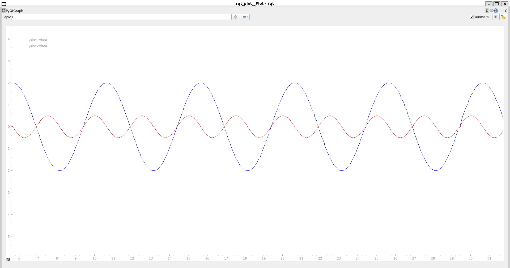

# `sim_zby_barna` package
ROS 2 C++ package.  [](https://docs.ros.org/en/humble/)
## Packages and build

It is assumed that the workspace is `~/ros2_ws/`.

### Clone the packages
``` r
cd ~/ros2_ws/src
```
``` r
git clone https://github.com/barna154/sim_zby_barna
```

### Build ROS 2 packages
``` r
cd ~/ros2_ws
```
``` r
colcon build --packages-select sim_zby_barna --symlink-install
```

<details>
<summary> Don't forget to source before ROS commands.</summary>

``` bash
source ~/ros2_ws/install/setup.bash
```
</details>

``` r
ros2 launch sim_zby_barna launch_example1.launch.py
```

# Szinusz jelgenerátor és összegző


### jelek megjelenítése:
``` r
ros2 run rqt_plot rqt_plot /sine1/data /sine2/data
```



